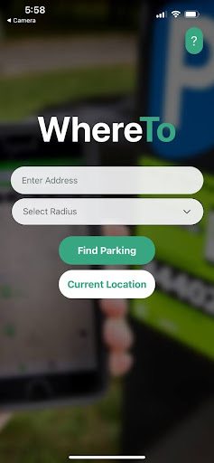
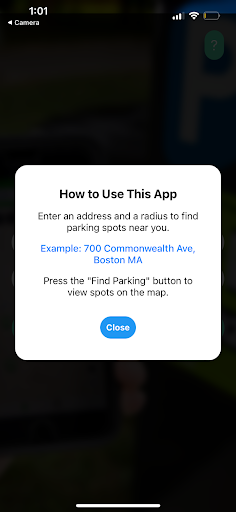
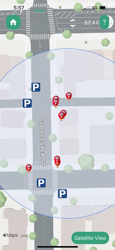
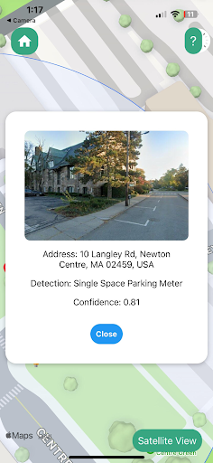

# Engineering Addendum

This is the Engineering Addendum for WhereTo, an application designed in order to provide real-time information about parking regulations in an area of interest.

## Table of Contents
1. [Project Status](#Project-Status)
2. [Local Quick Start](#Local-Quick-Start)
3. [Installation Notes and Common Errors](#Installation-Notes-and-Common-Errors)
4. [Cloud Hosting](#Cloud-Hosting)

## Project Status

Currently, WhereTo exhibits end to end functionality of its key requirements. WhereTo is intended to perform to the following specifications:
- Deliver relevant parking information to a user
- Efficient algorithm design
- Connectivity with Google APIs
- Use of machine learning and object detection  

  

These photos represent the current state of the application. A user is able to enter an address into the address bar and select a radius on the initial display. When entering the address, the user has the option of clicking `Current Location` to use their current location as the input address. Otherwise, the user is able to type out the address they intend to find parking for, as they do the frontend will attempt to autocomplete the address field for the user's benefit.  

After clicking on `Find Parking`, the request is send to the backend of WhereTo, where it is processed using a trained object detection model. This model can detect three types of objects: single-spaced parking meters, multi-spaced parking meters, and road signs. Each one of these detections is stored in the SQL cache, and forwarded to the frontend to be displayed on the map.

As can be seen, the user can access a detailed modal view on the WhereTo frontend to see an image of the parking meter or road sign that was detected. In the case of a road sign detection, WhereTo will also attempt to read the text from the sign for the user, to inform them of the parking regulations implied by the signage.  

This entire process requires integration with multiple APIs in order to collect both geographic and image data about an area of interest. Google's own APIs are used for both geocoding and image gathering, as well as for input prediction in the frontend. Efficient algorithms convert geographic data into requests to Google's Street View Static image API, in order to collect data to process and subsequently deliver the results to the user.

## Local Quick Start

Here are quick instructions for being able to start and run the WhereTo application locally for testing and development purposes. This guide will assume two things about your machine:
- `npm` is installed and up to date
- `python3` is installed and up to date
In order to run the application locally, both the backend and frontend must be hosted on one machine, or two machines on the same network. Additionally, testing the application will require the `Expo Go` application in the iOS or Android application stores. Below are instructions to properly download and run the frontend and backend repositories.

### Setting up Frontend

1. Download the frontend code, present inside of whereto-react-native-ui.
2. Navigate the integrated terminal in an IDE such as VS code to the root folder of the whereto-react-native-ui.
3. On the terminal inside of the frontend repository, run `npm i` in install and update all the required packages.
4. Modify the `GOOGLE_PLACES_API_KEY` in `whereto-react-native-ui/screens/InputDisplay.js` to your own personal valid Google Places API key. This key should be made on the Google Cloud Console. More instructions for this are found in `README_SOFTWARE.md`
5. Wait to run the frontend until the backend server is already running, you will need the IP address from the backend server output to run the frontend.
6. After completing the backend instructions, the correct IP addresses should be inside of `MapDisplay.js` and `InputDisplay.js`. Now run the frontend with `npx expo start`.
7. A QR code will be output to the terminal where you run the command. Scan this QR code with a mobile device with `Expo Go` installed in order to test and use the application.

### Setting up Backend

1. Download the backend code, present inside of whereto-python-api.
2. Navigate the integrated terminal in an IDE such as VS code to the root folder of the whereto-react-native-ui.
3. Create a virtual environment using `python3 -m venv venv`, if you do not have venv, use `python3 -m pip install venv` first.
4. Activate your venv. On MacOS and many Linux distributions, this will likely be `source venv/bin/activate`. On Windows, this will look like `venv\Scripts\activate`.
5. Now that the venv is activated, run `pip install -r requirements.txt` to install the requirements of the server. This can take a couple of minutes sometimes, especially if PyTorch and Ultralytics are not cached in your pip.
6. Configure your environment for google cloud: https://cloud.google.com/run/docs/setup. Ensure the project you select for your Google Cloud environment has API access to Google Cloud Vision
7. Additionally, provision an API key for your project on Google Cloud with access to both Geocoding and Google Street View Static API. This is elaborated on in `README_SOFTWARE.md`. Place `map_api_key` in a config.py file in `whereto-python-api`.
8. Navigate to https://buntinglabs.com/account/register. Create an account with your email. Log in using the email link they send you, and you will receive an API key. Place two new values into the config.py: `osm_extract_http="https://osm.buntinglabs.com/v1/osm/extract"` and `osm_extract_key="YOUR_API_KEY"`.
9. Install SQLite to your compute. This can be done on MacOS with `brew install sqlite3` if you have homebrew. With Linux one can use `sudo apt-install sqlite3`. With Windows, SQLite can be installed via a download from their website.
10. Using SQLite, create a database file called `whereto.db` inside of the `database/` folder. Run the schemas in `database/whereto.sql` in order to initialize the tables for the database.
11. Run the application with python3 app.py. If all API keys and the environment is configured properly, it should run and output the hosted address and port for the local network. Copy this IP address and paste it into the API calls present inside of `whereto-react-native-ui/displays/InputDisplay.js` and `whereto-react-native-ui/displays/MapDisplay.js`.

## Installation Notes and Common Errors
### API Keys and Google Cloud
It is vital to ensure that your API key grants your account access to all of the required APIs. The APIs required by the backend key are Google's `Static Street View API` and `Geocoding API`. The API required by the frontend key is Google's `Places API`. These can either be two seperate keys, or the same key with permission for all three APIs. It is not required to grant this key access to `Cloud Vision API` as that is accessed via the Google Cloud project permissions.

On the subject of `Cloud Vision API` it should be noted that if this does not function properly, one must ensure that the `Google Cloud SDK` is properly installed and active on their machine. They must additionally ensure they have the `gcloud CLI` available to them: https://cloud.google.com/sdk/gcloud. One must be authenticated with the `gcloud CLI` and have their project with `Cloud Vision API` enabled as their active project in order for the backend to function properly.
### API Keys and Bunting Labs
The Bunting Labs OSM Extract API key is necessary to collect the Geographic data used by WhereTo. In order to create an account, enter your email at https://buntinglabs.com/account/register and click `Sign Up`. They will email within 5 minutes with a login link. This link will allow you to see your `Free API Key`, which is the `osm_extract_key` in config.py.
### Network Settings
When testing locally, it is a lot simpler to have both machines on the same network, or host both the frontend and the backend on the same machine. If the backend is being hosted on the cloud, the frontend can be hosted from anywhere as long as it is capable of sending HTTP/HTTPS requests to the correct address and port.
## Cloud Hosting
Cloud hosting the application is more difficult, and elaborated on more in `README_SOFTWARE.md` for the backend dev tools. The general steps for Cloud hosting are the following (Google Cloud is heavily reccomended):
- Create a `Cloud SQL Database`, and use it to create the tables present in `database/whereto.sql`.
    - Create this under the same project you created your API keys and enabled APIs for
    - Replace the SQL link configuration in the `WhereTo` module in the backend with the External IP of the `Cloud SQL Database`.
- Create a `Compute Engine VM`
    - Create this under the same project you created your API keys and enabled APIs for
    - There are not many limitations with what specifications you can choose for a machine, but it is required to have a Boot Disk Size of around 50GB or larger, as well as allowing your newly created VM to have access to the same Google APIs as your project, enabling `Cloud Vision API`
    - Allow this VM to receive HTTP and HTTPS requests when creating it, additionally ensure your VM's firewall rules allow for the frontend application to access whichever port the backend is hosted on.
- SSH into the `Compute Engine VM` using Google Console
    - Clone the backend git repository to the VM, using sudo. You may need to install git in order for this to work properly.
    - Use `sudo chown` to change the permissions of the repo to your user.
    - Ensure the proper variables are set in config.py (explained in steps above)
    - Install venv and pip using `sudo apt-install`
    - Run `python3 -m venv venv`
    - Run `source venv/bin/activate`
    - Run `pip install -r requirements.txt`
    - Run `python3 app.py`, once again ensure that the port is available according to the Google Cloud firewall settings for your VM
- Frontend setup is the same, but the API request link inside of `whereto-react-native-ui/displays/MapDisplay.js` and `whereto-react-native-ui/displays/InputDisplay.js` should be now the External IP of the `Compute Engine VM` hosting the backend.
- The benefits of cloud hosting are that it enables one to connect to the backend from anywhere, and allows one to see how the application can perform under ideal conditions, when it is ran on a dedicated server.

