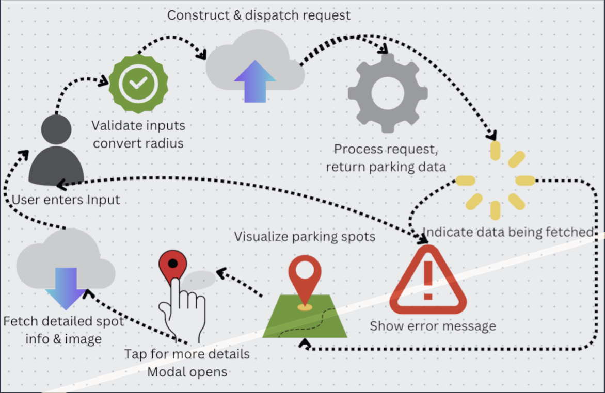

# Software Report

WhereTo is an application designed to solve the problem of locating parking and navigating complex parking restrictions. By leveraging Google Street View image data and machine learning, WhereTo aims to deliver real-time parking regulation information to its users.

## Table of Contents
1. [High Level System Overview](#High-Level-System-Overview)
2. [Modular Overview Frontend](#Modular-Overview-Frontend)
3. [Modular Overview Backend](#Modular-Overview-Backend)
4. [Frontend Dev Tool Information](#Frontent-Dev-Tool-Information)
5. [Backend Dev Tool Information](#Backend-Dev-Tool-Information)
6. [Frontend Installation and Use](#Frontend-Installation-and-Use)
7. [Backend Installation and Use](#Backend-Installation-and-Use)

## High Level System Overview
  
Figure 1 - WhereTo software system diagram  

The system design approach of WhereTo is quite simple from a high level perspective.  

The WhereTo software ecosystem consists of three components: 
- The React Native UI: a multi-platform mobile application for which the user is able to interact with to locate parking regulations in a desired area
- The Python Server: computes the expected parking regulations of the desired area, also acts as a way for the frontend to access specific detections from the cache
- The SQL database: used for caching of parking regulations in a desired area  

Given that there are only three components to WhereTo itself, understanding a simple request and how it flows through at a high level should be quite clear. The following is the general process with no errors:  
1. The user enters an address and radius value into the React Native user interface on either iOS or Android, and presses “Find Parking”
2. The React Native user interface makes a request to the Park API in the Python server, to compute the parking regulations at the requested location and radius
3. The Python server’s Park API computes the regulations using machine learning in addition to interactions with various Google APIs and the Bunting Labs OSM Extract API (Further elaborated on in section III)
4. The Python server sends each parking regulation detection to the SQL cache, to be used in the future instead of the APIs and machine learning process
5. The Python server sends a list of detections to the React Native UI
6. The React Native UI presents the list of detections to the user in map format, giving a visual representation of parking information to the user
7. The user is able to press on any marker representing a detection, in order to view detailed information about it, this detailed information comes from the other API within the Python server, the Detail API  

If there is an error at any point in the process, the Python server sends such information to the user interface, which will update the user with the information.  

The last important thing to remember from a high level perspective is what is meant by the word “detection”. A detection in our system is wherever our machine learning object detection models recognize one of three things: a single-space parking meter, a multi-space parking meter, and a road sign. Each of these has different implications and displays on the frontend.

## Modular Overview Frontend

Here's a detailed breakdown of the frontend architecture for the WhereTo application, structured into distinct modules and components:

- InputDisplay Module:
    - Manages user inputs for address and radius using a React component.
    - Utilizes the Google Places API for address autocomplete to enhance user experience.
    - Incorporates a dropdown picker for selecting search radius, simplifying user interaction.
    - Handles the sending of user parameters to the backend via Axios, initiating the search process.
- MapDisplay Module:
    - Renders the search results on an interactive map using React Native Maps.
    - Displays custom markers at detected parking locations which users can interact with to obtain more details.
    - Integrates a dynamic display of parking information, updating in real-time as the user explores the map.
- MarkerInfoModal Component:
    - A modal that pops up when a user taps on a map marker, showing detailed information about the parking detection.
    - Displays data such as the confidence level of the detection, the exact address, and any relevant images.
    - Enhances user interaction by providing in-depth details about specific parking spots.
- HelpModal Component:
    - Provides users with guidance on how to navigate the map and utilize the application effectively.
    - Aims to enhance user understanding and ensure a smoother user experience by clarifying application functionalities.
- CustomMarker Component:
    - Used within the MapDisplay module to render markers with custom icons on the map.
    - Differentiates between types of detections (e.g., parking meters vs. road signs) by using distinct icons, making it visually easy for       users to identify the type of information provided.
- App Component:
    - Serves as the root component that orchestrates the display of either the InputDisplay or MapDisplay based on user interaction.
    - Manages key state variables like whether the map is being displayed and what data it should show, facilitating communication between        the user interface and the backend.
- Styles and Utilities:
    - Include CSS stylesheets that define the aesthetic elements of the application, ensuring a consistent and engaging user interface.
    - Utility functions help with processing tasks such as formatting responses from the backend or handling image data conversions,              supporting the functional aspects of the frontend modules.
  

The frontend architecture of the WhereTo application is the backbone for connecting the user's needs to the robust backend processing of parking data. The frontend is made with React Native, allowing for a seamless and responsive user experience on both iOS and Android platforms.

The frontend architecture orchestrates the flow of data between the user interface and the backend systems. It manages this through the InputDisplay module, which collects user input and dispatches API calls to the backend's /park endpoint. Once the data is fetched, the MapDisplay module updates to show the current parking situation, represented by markers on the map. The frontend also communicates with the backend's /detail endpoint to retrieve detailed information about each parking detection when a user interacts with a marker. This interaction pattern showcases the frontend's ability to handle both the initiation of data retrieval processes and the subsequent presentation of this data in a user-friendly format.

The InputDisplay component serves as the initial user interface, offering a streamlined method for input gathering and validation. It employs the Google Places Autocomplete functionality for efficient address input and employs the Expo Location API for retrieving the user's current location. A Help Modal is integrated within this module to provide instructional support. Additionally, the InputDisplay module transforms the search radius into backend-compatible units and interfaces with Axios to manage API calls. On triggering a search, it dispatches a request to the backend's '/park' endpoint and manages the response, whether it's a successful data retrieval or an error message. The module also controls UI elements such as loading indicators and error messages to communicate the application's state to the user effectively.

The frontend architecture utilizes Axios for API interactions, constructing requests that are then dispatched to the backend's /park endpoint. It handles these interactions by managing the states of the requests and systematically presenting the user with UI feedback. During the request lifecycle, Axios plays a pivotal role in managing state transitions that indicate data fetching progress and relaying any errors back to the user interface. This ensures that users are well-informed of the app's current state, enhancing the user experience.

Upon receiving user inputs, the frontend leverages external APIs to translate addresses into precise geographic coordinates. It then invokes the react-native-maps library to render an interactive map, populating it with markers that correspond to available parking data obtained from the backend. This integration with the backend is streamlined, involving requests to the '/detail' endpoint for enriched information on selected parking spots. The modular design ensures that the system handles user interactions efficiently, overlaying the relevant parking data on the map and enabling users to retrieve detailed information with a simple touch interaction. This setup underscores the frontend’s role in facilitating a seamless flow of information from the backend algorithms to the user interface.

Within the frontend's MapDisplay module, interactivity is key; users can engage with the map markers to reveal comprehensive details of each parking location. When a marker is selected, a modal is triggered, displaying information such as the parking spot's address, the confidence level of the detection, and the associated image. The image handling mechanism within this module is particularly adept, converting base64-encoded strings back to binary format for image rendering, thereby streamlining the data transfer process. This efficient encoding strategy allows the embedding of image data directly within API responses, reducing the need for additional HTTP requests.
In terms of visual options, the MapDisplay module provides a feature to toggle between standard and satellite views of the map, enhancing user experience by offering diverse visual representations of the terrain. This function exemplifies the module's versatile presentation capabilities, accommodating user preferences for map displays.

## Modular Overview Backend  

Below are simple descriptions of each module in the backend:  
- Database Access Module:
    - This module is responsible for defining the models for the data being stored in the SQL cache. Additionally, this module implements the functions necessary for interacting with the SQL cache, which are used by other modules.
- Detail API Module:
    - The DetailAPI is the module for an API which allows the requester to input a detection id  and receive a response containing detailed information about that detection.
- OSM Module:
    - This module is responsible for loading extract data from Open Street Maps and formatting it to our specifications. It utilizes an external API to get the street information, and formats the response into a list of streets.
- Machine Learning Module:
    - This module is responsible for utilizing the loaded PyTorch file in our applications machine learning workflow. It traverses over an area, scanning images with the model to detect regulations and meters.
- Park API Module:
    - This module is responsible for running the main algorithm pipeline for analyzing parking information in a given area. This module calls functions from the OSM and Machine Learning Modules in order to complete its workflow.
- Text Processing Module:
    - This module is a completely independent module, responsible for implementing a single function in order to detect text in an image 
- WhereTo Module:
    - This module is responsible for defining many application constants.
- Testing Module:
    - This test/ folder is responsible for holding the functionality unit tests for each module.
- app.py Module:
    - This module is the main driver module for the backend, it adds the resource APIs to the application and begins running it.
- config.py Module:
    - This module is defined separately for each instance where the WhereTo backend is hosted. Elaborated on later.  

Below is a high level diagram, showing the relationships between each of these modules in the backend.  
  
Figure 2 - WhereTo backend software system diagram  

The high level perspective shows the interactions between each of the modules in the backend Python server.

The application is run by using the app.py driver code. This main module depends directly on the Park API and Detail API, as well as the WhereTo core module constants. App.py adds both the Park and Detail APIs as resources, giving them endpoints on the server. App.py then begins to run the server if it is run as a script, rather than a module. It does this through importing both the api and app constants from the WhereTo core module.

The Park API is an endpoint, hosted on the app.py server, which computes parking regulations by detecting road signs and parking meters in a given area. In order to perform this computation, Park API relies on both the OSM and Machine Learning modules, which are internal to the WhereTo system. The Park API operates by first error checking the address and radius inputs. After ensuring that the inputs are correctly formatted and valid, the Park API proceeds to query Open Street Maps data through the OSM module. It then uses this data to run the object detection model, via the Machine Learning module. After running both of these processes, the Park API formats the output into a list of detections, attempts to sanitize it for duplicate outputs, and returns a response to the requester.

The OSM module is an internal module to the WhereTo backend software system. The OSM module does not depend on any other internal components, although it does depend on an external API. It implements a number of functions for querying Open Street Maps via the Bunting Labs extract API. The main function in the module, query_osm, calls this extract API, and then maps the output using a helper function, map_geo_data, to a more usable format. This format is a dictionary, where each entry is a street name and a list of coordinates in order representing the traversal down the street.

The Machine Learning module is another module that is internal to WhereTo. The Machine Learning module is how WhereTo is able to detect objects in an area, read text from road signs, and store the information for later use. The module is able to accomplish these tasks through interactions with the Text Processing, Database Access, and WhereTo internal modules. Additionally, the Machine Learning module relies on the Google Street View Static image API in order to collect data. The most important function in the Machine Learning module is the run_model function. This function iterates through each street inside of the dictionary returned from the OSM module functions. For each street, it iterates through the coordinates, downloading image data from Google Street View, and processing the images through the machine learning algorithm to detect objects and determine parking regulations.

Text Processing is a very simple internal module. It relies only on Google Cloud Vision API, and does not depend on any internal WhereTo components. The Text Processing module only has one function, which accepts an input image and attempts to read any text from the image. It returns a string which is all the text read from the image. One string should theoretically contain enough information in this case, as the Text Processing module is only called on images of cropped single road signs.

The Detail API is the other endpoint, besides Park API, hosted on the app.py server. The Detail API only relies on the Database Access module for internal components, but also relies on Google API services for geocoding and downloading image data. The Detail API accepts a detection id in a request, and returns detailed information about this detection id, including a photograph of it, and the text from it, if it is a road sign. The Detail API relies on Database Access in order to retrieve information about a given detection id.

The Database Access module relies only on the WhereTo internal component for retrieving the db constant. Additionally, the Database Access module relies on connectivity to wherever the WhereTo database is stored, be that locally in SQLite or on the Cloud. The Database Access module implements every function which requires querying the database in order to retrieve or update information. It is a wrapper around the SQL cache of the WhereTo system.

The WhereTo module itself is a simple module that defines constants used by a few of the components in the WhereTo backend. WhereTo defines the app, api, model, and db constants. These constants are used across the application. This module is also where the SQL link is assigned for Flask SQLAlchemy; therefore, when attempting to switch between locally hosted and cloud hosted SQL environments, this configuration should be modified.

Both the config.py and test/ modules are not shown in this diagram. The test/ module relies on every component present in the WhereTo backend system, as it is responsible for testing each one of the modules. The config.py module relies on no other module, and defines vital constants for application functionality.

The config.py module is a file which should be defined on a person's local or cloud hosted instance. It should never be pushed to Github as it contains important api token and secret information which should not be made public. In order to compile and run the WhereTo backend, config.py MUST be added. It should contain the following, which will be elaborated on later: the constants map_api_key, osm_extract_key, and osm_extract_http.  

Below is a table showing the backend system from the outside perspective, where there are two possible endpoints:

 

| Endpoint | Method | Description | Request Body | Response |
|----------|--------|-------------|--------------|----------|
| `/park` | POST | Evaluate parking regulations in area | Address and Radius | Dictionary mapping streets to detections |
| `/detail` | POST | Get information about detection ID | Detection ID | Detailed detection information |

 

## Frontend Dev Tool Information

The WhereTo frontend is constructed with an array of development tools and services designed to create a responsive and user-friendly mobile application. Key technologies and services include:
- React Native: Utilized for building cross-platform mobile applications.
- React Native Maps: Facilitates the display and interaction with geographical data.
- React Native Dropdown Picker: Provides dropdown selections for user inputs.
- Axios: Manages API requests to the backend.
- Google Places API: Enhances address input functionality through autocomplete suggestions.
- Expo Location: Fetches the geographical location of the user.

### Development of the WhereTo frontend setup
- Install Node.js and npm, which includes the React Native command-line interface, the JavaScript runtime and package manager needed to       manage the application's dependencies
- Use Expo CLI for running the application on a simulator or a physical device, which requires the installation of Expo Go on the latter.
- React Native CLI: A command-line tool for initializing and working with React Native projects.

### Install Expo CLI
Open a terminal or command prompt, and install the Expo CLI globally using npm by running:
- `npm install -g expo-cli`

### Install the Expo Go App
- Download the Expo Go app from the Google Play Store or Apple App Store on your mobile device.
- Make sure your computer and mobile device are connected to the same Wi-Fi network.

For detailed interaction with backend services, developers should:
- Configure Axios to connect with the backend server, whether it's hosted locally or on the cloud.
- Manage API keys for Google Places API securely.

The frontend integrates with cloud services when hosted on platforms such as Expo, which facilitates the building, deployment, and quick iteration of React Native applications. For local development, React Native Debugger or similar tools can be used for debugging and state management inspection.

### Google API and Account Set Up

In order to use the Street View and Geocoding APIs from Google, you will need access to them via an API key. This API key must be granted permission under the Google Cloud Console to access the Street View and Geocoding APIs. Inside of the config.py file in the backend, map_api_key is stored. This key is the API key for all Google services used by WhereTo via HTTP request. The following process is how to obtain a valid API key for these Google services:
1. Sign into your Google account, and go to: https://console.cloud.google.com/
2. Create a New Project, giving it a Project Name
3. With that project selected on the console, navigate to the `APIs & Services` tab, and click on the `+ ENABLE APIS AND SERVICES` button
4. Enable the following APIs: `Places API`
5. Place the automatically created API key into the map_api_key value in config.py. This will enable application connectivity with Google API services for Geocoding and Street View Static APIs.

## Backend Dev Tool Information

The backend system relies on the following list of developement tools and essential services:
- Python 3.8
- Google Street View Static API
- Google Cloud Vision API
- Google Cloud Geocoding API
- Bunting Labs OSM Extract API

If the system is being hosted using cloud services, we have used Google Cloud Servies which adds the following developement tools and services to the list:
- Google Cloud SQL Enterprise
- Google Cloud Compute Engine

In order to develop and test the application, one will need to ensure their environment is set up to run these tools and connect with these services.

### Python 3.8 Set Up

If you are using either MacOS or Windows, downloading Python 3.8 is possible by going to the official python website and downloading the installer for the correct operating system.  

For Linux users, or if one is deploying to a linux-based cloud instance, one can run `sudo apt-get install python3.8`.  

To check version, either enter `python -version` or `python3 -version` in your terminal, anything >=3.8 should work.

### Google API and Account Set Up

In order to use the Street View and Geocoding APIs from Google, you will need access to them via an API key. This API key must be granted permissions under the Google Cloud Console to access both the Street View and Geocoding APIs. Inside of the config.py file in the backend, map_api_key is stored. This key is the API key for all Google services used by WhereTo via HTTP request. The following process is how to obtain a valid API key for these Google services:
1. Sign into your Google account, and go to: https://console.cloud.google.com/
2. Create a New Project, giving it a Project Name
3. With that project selected on the console, navigate to the `APIs & Services` tab, and click on the `+ ENABLE APIS AND SERVICES` button
4. Enable the following APIs: `Cloud Vision API`, `Street View Static API`, and `Geocoding API`. Add both `Street View Static API` and `Geocoding API` to the newly created API key. Cloud Vision will require separate configuration.
5. Place the automatically created API key into the map_api_key value in config.py. This will enable application connectivity with Google API services for Geocoding and Street View Static APIs.
6. For the Cloud Vision API, one will need to have the gcloud CLI installed on their machine (unless they are using a Google Cloud VM instance). Instructions for downloading this to ones machine can be found here: https://cloud.google.com/sdk/docs/install. 
7. After installing the CLI, authenticate via the browser to the CLI and navigate to the WhereTo backend directory root. From this root, ensure that the current project is the project for which you enabled Cloud Vision API. This can be done with the command `gcloud config get-value project`  

### Bunting Labs API Set Up

The Bunting Labs OSM Extract API is vital to WhereTo's functionality. It is how WhereTo is able to navigate and traverse the streets in the area requested. In order to access Open Street Maps data in a simple way with our API, we integrate with the Bunting Labs API. The following are the steps to achieve connectivity:
1. In config.py, the following should be placed: `osm_extract_http= "https://osm.buntinglabs.com/v1/osm/extract"`.
2. Create a bunting labs account: https://buntinglabs.com/account/register, they will send an email for you to log in. 
3. On the website once logged in, you should be able to see your API key. Place this in config.py as the following: `osm_extract_key= "your_free_api_key"`

### Google Cloud SQL Enterprise
If you intend to host the backend in a cloud environment, it is suggested to opt for Google Cloud. The reasoning behind this is it allows for easier integration with the Google services that already build the backbond of the backend algorithms and data. In order to use Google Cloud to host both SQL Enterprise and Compute Engine, the `Compute Engine API` needs to be enabled for your previously created Google Cloud project.  

Once the required API is enabled, you can create a Cloud SQL instance according to your requirements. Once this instance has been created, allow it to be accesssed by any virtual machines running on your project. Additionally, place the externap IP of your Cloud SQL instance in the WhereTo module at `app.config['SQLALCHEMY_DATABASE_URI']`. Further first time deployment procedures can be found below in [Backend Installation and Use](#Backend-Installation-and-Use).

### Google Cloud Compute Engine
As stated above for Cloud SQL Enterprise, Google Cloud is the suggested Cloud provider to use for ease of integration with their APIs. In order to host the backend on the cloud, `Compute Engine API` needs to be enabled for your Google Cloud project.  

Once the required API is enabled, you can create a Cloud VM instance in the Google Console according to the requirements you have. The only steadfast requirement of WhereTo in this configuration is a boot disk size of over ~50GB to account fo all of the dependencies of WhereTo. Further deployment procedures can be found below in [Backend Installation and Use](#Backend-Installation-and-Use). Make sure that this VM is given access to all of the required APIs, notably the Cloud Vision API.

## Frontend Installation and Use

### Frontend Installation 

Environment Setup:
    - Ensure that Node.js and npm (Node Package Manager) are installed on your system. You can download them from Node.js official site.
  
Clone the Repository:
    - Obtain the frontend code by cloning the repository using Git, or by downloading the source files directly from project's repository.

Navigate to Your Project Directory:
    - `cd whereto-react-native-ui`

Install Dependencies:
Run the following command to install the necessary dependencies listed in package.json:
    - `npm install`

Expo Setup:
Since the project utilizes Expo for managing the React Native environment, ensure Expo CLI is installed:
    - `npm install -g expo-cli`

### Running Frontend 

Start the Development Server:
- Use the following command to start the Expo development server:
    - `npx expo start`
 
Using Expo Go App:
- Connect your mobile device to the same wireless network as your computer
- Use the Expo Go app to scan the QR code from your Terminal

## Backend Installation and Use
The use of the backend in the WhereTo is entirely through the frontend, but the API can be accesed via the external IP and port of wherever you host the WhereTo main python server in app.py.  

The installation steps vary slightly depending on if you are hosting the backend locally or in the cloud. 

### Locally Hosted
Assuming prior API setup and Python installation, here are instructions if you are hosting locally using SQLite:
1. Navigate to the root of the backend project directory in your terminal
2. Create a Python virtual environment with `python3 -m venv venv`
3. Activate the Python virtual environment.
4. Within the virtual environment, download the required dependencies with `pip install -r requirements.txt`.
5. Create the local database using SQLite in the `datbase/` folder, named `datbase.db`. Using the SQLite CLI, add the tables defined in `database/WhereTo.sql` to database.db. Ensure the application is configured in the WhereTo module to run with SQLite.
6. Run the application with `python3 app.py`.

### Cloud Hosted
Here is how to host the backend if you have a Cloud VM instance and a Cloud SQL instance available:
1. Use the Google Cloud CLI in order to add the tables defined in the `database/WhereTo.sql` file to your Cloud SQL database. 
2. SSH into your Cloud VM instance, exact commands for setup will now depend on the exact OS you select for your hosting.
3. Download and install git, python, python-pip, and python-venv to your system.
4. Use git to clone the backend repository to the VM, navigate into the repository 
5. Create a Python virtual environment with `python3 -m venv venv`
6. Activate the Python virtual environment.
7. Within the virtual environment, download the required dependencies with `pip install -r requirements.txt`.
8. Ensure that the WhereTo module has the correct configuration for the database access link, which is the external IP of the Cloud SQL instance.
9. Run the application from the SSH with `python3 app.py`.
10. The application can be monitored from the SSH prior to closing or from Google Cloud logging after closing.
